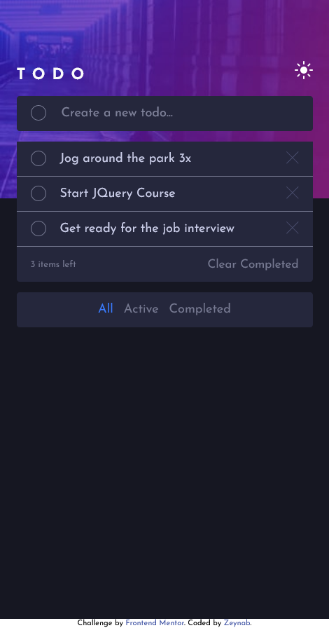
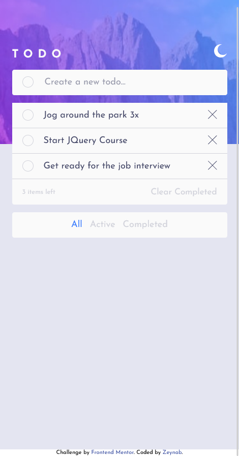

# Frontend Mentor - Todo app solution

This is a solution to the [Todo app challenge on Frontend Mentor](https://www.frontendmentor.io/challenges/todo-app-Su1_KokOW). Frontend Mentor challenges help you improve your coding skills by building realistic projects. 

## Table of contents

- [Overview](#overview)
  - [The challenge](#the-challenge)
  - [Screenshot](#screenshot)
  - [Links](#links)
- [My process](#my-process)
  - [Built with](#built-with)
  - [Continued development](#continued-development)
  - [Useful resources](#useful-resources)
- [Author](#author)

## Overview

### The challenge

Users should be able to:

- View the optimal layout for the app depending on their device's screen size
- See hover states for all interactive elements on the page
- Add new todos to the list
- Mark todos as complete
- Delete todos from the list
- Filter by all/active/complete todos
- Clear all completed todos
- Toggle light and dark mode
- **Bonus**: Drag and drop to reorder items on the list

### Screenshot

### Links

- Solution URL: [Solution on Github](https://github.com/zeynabmvs/TodoAppFEM)
- Live Site URL: [Live Site]()

## My process

### Built with

- Semantic HTML5 markup
- CSS custom properties
- Flexbox
- CSS Grid
- Mobile-first workflow
- SASS
- [jQuery](https://jquery.com/) - jQuery

### Continued development

- adding drag an drop feature for the tasks list

### Useful resources

- [Youtube tutorial for Toggle](https://www.youtube.com/watch?v=-3WV1CjeF10) -This 5 part tutorial helped me to build the dark/light toggle 

## Author

- Frontend Mentor Profile - [@zeynabmvs](https://www.frontendmentor.io/profile/yourusername)
- LinkedIn - [@Zeynab movasaqpoor](www.linkedin.com/in/zeynab-movasaqpoor-485b57b1)
